# Аутентификация и авторизация. Протокол OAuth 2.0

### Задание

В index.html добавить возможность авторизации через какой-либо сервис (например “Авторизация через Google”) по аналогии с авторизацией VK.

• Для проверки домашнего задания приложи:
 - скриншот с кнопками авторизации,
 - скриншот авторизации через внешний сервер,
 - скриншот страницы с успешной авторизацией,
 - скриншот из Django-admin, где помимо администратора есть как минимум 2 учетных записи

### Настройка виртуального окружения
Виртуальное окружение настраивается по аналогии с описанием из [репозитория](https://github.com/selvnv/py-setup)

#### Зависимости:
* Основные:
  * `django`
  * `social-auth-app-django`

Активация виртуальной среды (Windows): `.\.venv\Scripts\activate`

Создание проекта в корневой директории: `django-admin startproject oauth .`

Создание сервиса: `py .\manage.py startapp auth_service`

#### Регистрация сервисов:
```python
# settings.py
INSTALLED_APPS = (
    # ...
    'social_django',
    'auth_service',
    # ...
)
```

#### Регистрация шаблонов
```python
# settings.py
TEMPLATES = [
    {
        # ...
        'OPTIONS': {
            # ...
            'context_processors': [
                # ...
                'social_django.context_processors.backends',
                'social_django.context_processors.login_redirect',
                # ...
            ]
        }
    }
]
```

#### Добавление настроек аутентификации

```python
# settings.py
AUTHENTICATION_BACKENDS = (
    'social_core.backends.google.GoogleOAuth2',
    # ...
    'django.contrib.auth.backends.ModelBackend',
)

# На какой endpoint выполняется редирект после аутентификации - не влияет на процесс аутентификации
LOGIN_REDIRECT_URL = '/profile/'

# Ключи, полученные для приложения-клиента на Google Cloud
SOCIAL_AUTH_GOOGLE_OAUTH2_KEY = 'SOME_CLIENT_ID_HERE'
SOCIAL_AUTH_GOOGLE_OAUTH2_SECRET = 'SOME_SECRET_KEY'

# Данные запрашиваемые клиентом (приложением) при аутентификации
SOCIAL_AUTH_GOOGLE_OAUTH2_SCOPE = ['profile', 'email']
```

#### Настройки интеграции со сторонними сервисами

> [!TIP]
> Настройки для конкретного сервиса можно найти в документации `social-auth`. Пример для [Github](https://python-social-auth.readthedocs.io/en/latest/backends/github.html), [Google](https://python-social-auth.readthedocs.io/en/latest/backends/google.html)

Для того, чтобы настроить интеграцию со сторонним сервисом, необходимо добавить наше приложение-клиент в список авторизованных на выбранных сервисах.

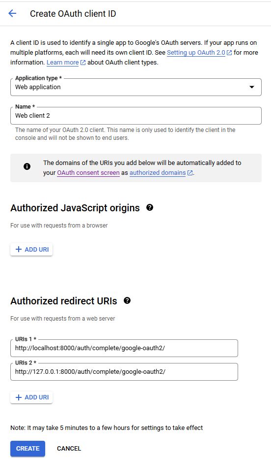

При "регистрации" приложения нужно указать URI для перенаправления пользователя после выполнения входа в формате `<protocol>://<domen><:port></path>/complete/<provider>/`

Например, в `urls.py` `social_django.urls` включен по пути `auth/`
```python
# urls.py
urlpatterns = [
    # ...
    path('auth/', include('social_django.urls', namespace='social')),
]
```
А запуск приложения производится на локальной машине. В терминал при запуске выводится следующая информация:
```baash
Django version 5.1.7, using settings 'oauth.settings'
Starting development server at http://127.0.0.1:8000/
Quit the server with CTRL-BREAK.
```


Это означает, что в `Authorized redirect URIs` нужно указать:
* Протокол: `http`
* Домен: `127.0.0.1` или `localhost`
  * Важно: `127.0.0.1` и `localhost` воспринимаются сторонними сервисами как разные адреса. Если указан только один из них, то по второму авторизация работать не будет
* Порт: `8000`
* Путь: `auth`
  * Если `social_django.urls` включен "в корень", то путь не указывается. Проверить наличие пути можно при выполнении запроса к сервису в `Dev-Tools`
* Провайдер (сервис авторизации): `google-oauth2`

Определение пути в QueryString при выполнении запроса к сервису:
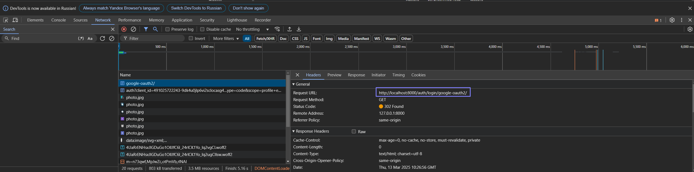

После выполнения этого шага сервис предоставляет ключи авторизации для нашего приложения. В случае с Google это `Client ID` и `Client secret`. Они указываются в настройках проекта `settings.py` в константах `SOCIAL_AUTH_GOOGLE_OAUTH2_KEY` и `SOCIAL_AUTH_GOOGLE_OAUTH2_SECRET` соответственно

#### Регистрация маршрутов
```python
# auth_service/urls
from django.urls import path

from auth_service.views import index, profile

urlpatterns = [
    path('', index, name='index'),
    path('profile/', profile, name='profile'),
]

# oauth/urls
from django.contrib import admin
from django.urls import path, include

urlpatterns = [
    path('admin/', admin.site.urls),
    path('', include('auth_service.urls')),
    path('auth/', include('social_django.urls', namespace='social')),
]
```

### Запуск

Выполнение миграций: `py .\manage.py migrate `

Запуск сервера: ` py .\manage.py runserver`

### Пример аутентификации через Google аккаунт

Страница входа (`index.html`)

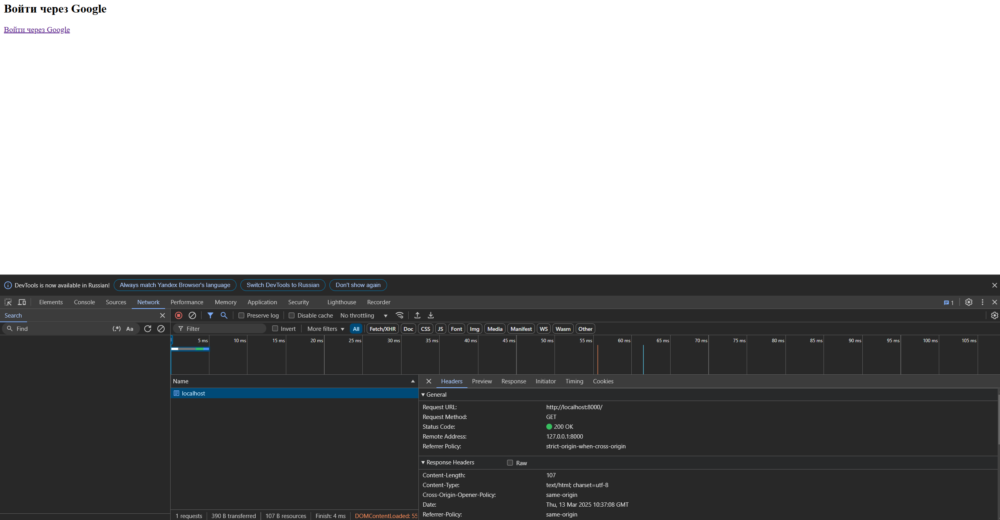

Страница выбора аккаунта Google

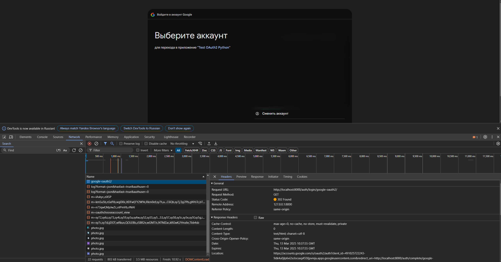

Подтверждение предоставления данных приложению

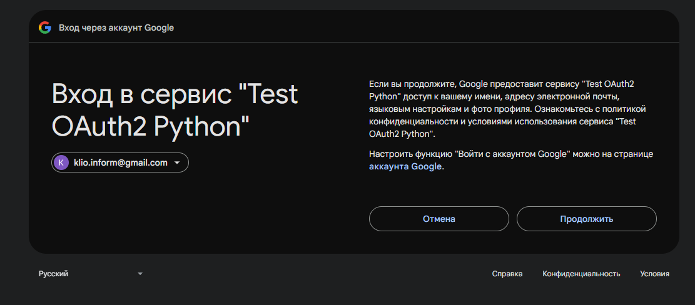

Страница профиля пользователя (`profile.html`)

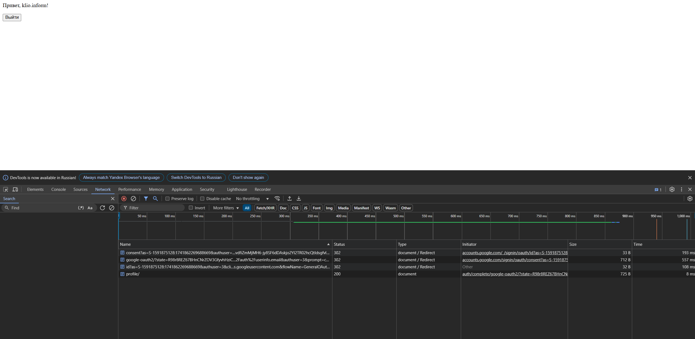

Скриншот из панели управления

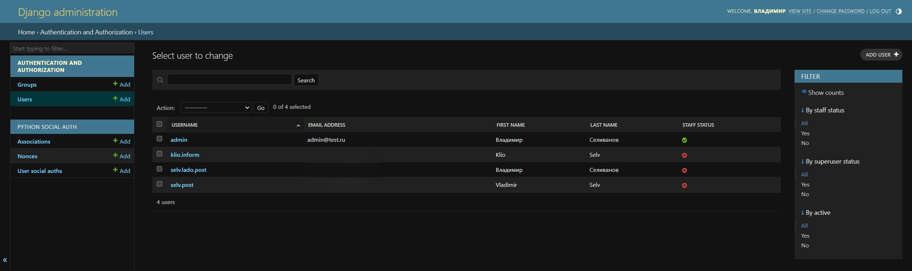

### Пример настройки аутентификации через Github

[Статья на github](https://docs.github.com/en/apps/oauth-apps/building-oauth-apps/authenticating-to-the-rest-api-with-an-oauth-app)

#### Регистрация приложения

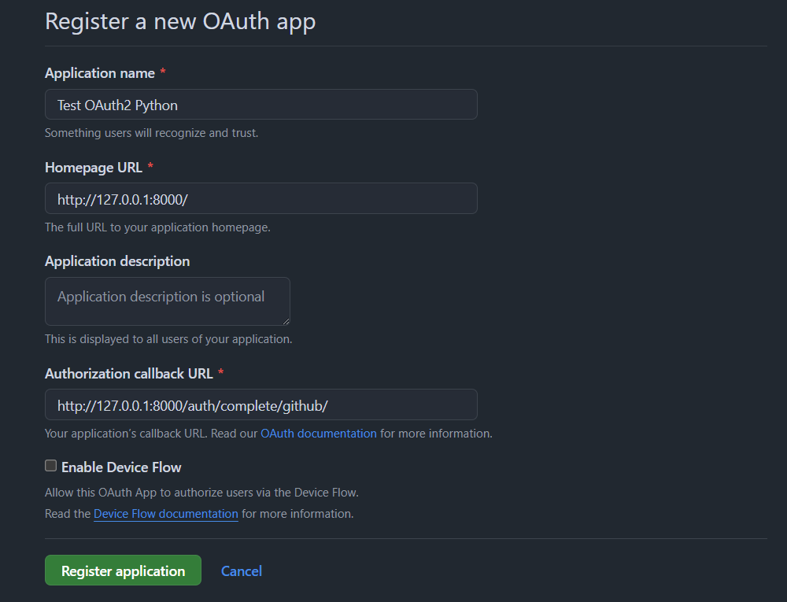

Получение токенов

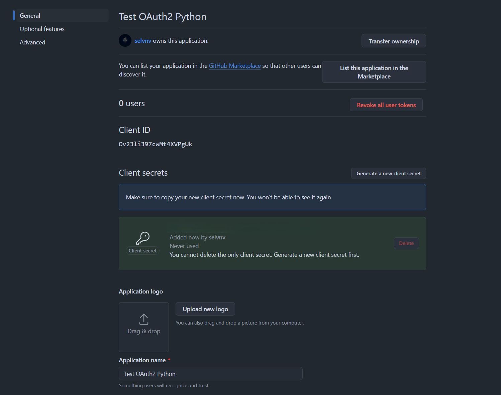

#### Настройки на стороне Django-приложения

Прежде всего указываются настройки проекта в `settings.py`
```python
# settings.py
AUTHENTICATION_BACKENDS = (
    # ...
    'social_core.backends.github.GithubOAuth2',
    'django.contrib.auth.backends.ModelBackend',
)

SOCIAL_AUTH_GITHUB_KEY = 'SOME_CLIENT_ID_HERE'
SOCIAL_AUTH_GITHUB_SECRET = 'SOME_SECRET_HERE'
# Скоупы указывать не обязательно. Их перечень можно найти 
# в документации конкретного сервиса, через который настраивается аутентификация
SOCIAL_AUTH_GITHUB_SCOPE = ['user']
```

Затем необходимо добавить ссылку в элемент для перенаправления на страницу авторизации стороннего сервиса

```html
<!-- Some HTML-code here -->
<a href="">Войти через Github</a>
<!-- Some HTML-code here -->
```

#### Авторизация через Github

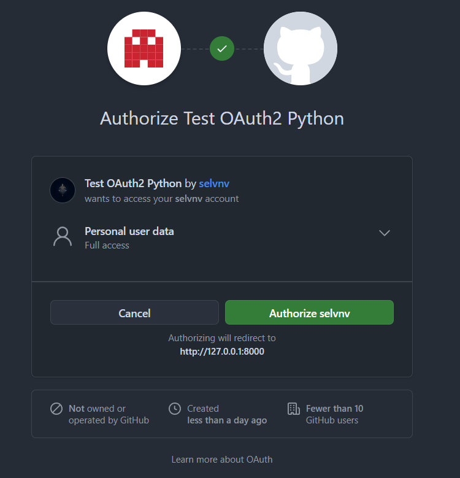

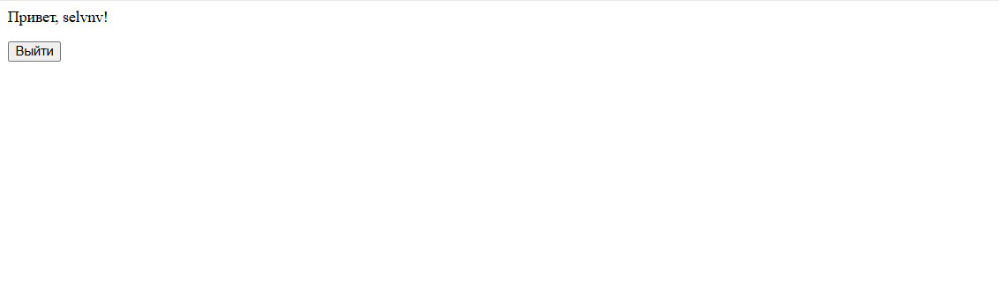